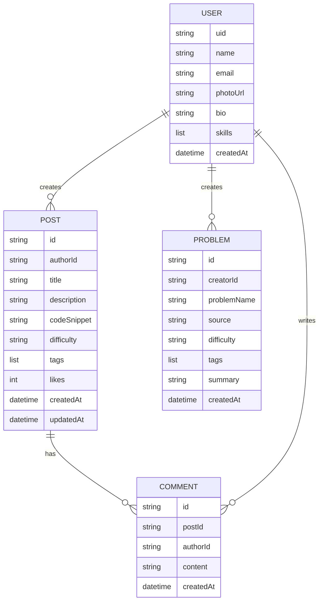
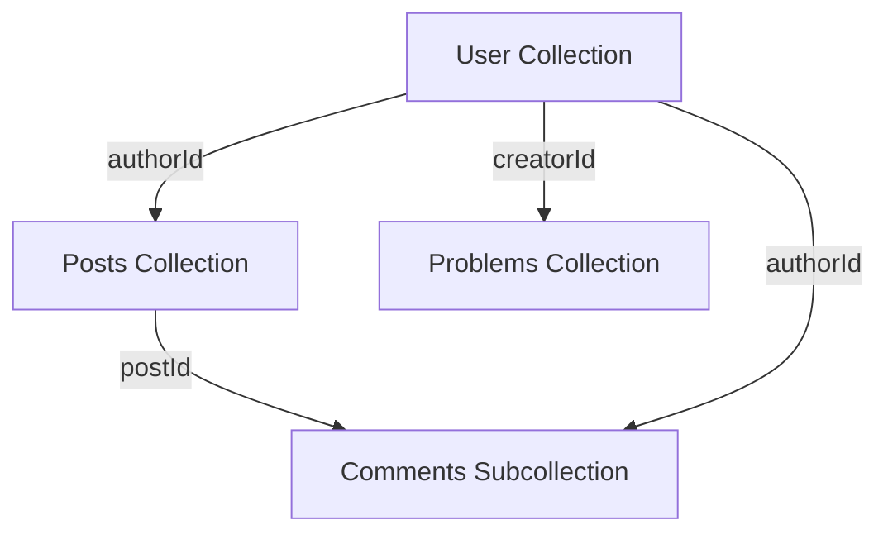

# ProblemSolversHub - Project Report

## 1. Overview

### Project name
- `ProblemSolversHub`

### Project overview
ProblemSolversHub is a cross-platform Flutter application designed to help developers and learners create, share, discover, and collaborate on programming problem solutions. The app emphasizes structured solution posts, community feedback, and searchable learning content powered by Firebase.

### Main purpose
- Enable users to document algorithmic and competitive programming solutions.
- Build a knowledge-sharing environment for problem-solving techniques.
- Support collaborative learning through comments, likes, and post discovery.

### Target users
- Competitive programming students.
- Software developers learning new algorithms and patterns.
- Teachers and mentors sharing problem-solving strategies.
- Developers building a portfolio of code walkthroughs.

## 2. Goal

### Primary goal
Deliver an interactive platform where users can publish detailed problem solutions, search for learning content, and engage with peers through a modern app interface.

### Secondary goals
- Provide easy onboarding with Firebase authentication.
- Organize content by difficulty, tags, and problem type.
- Support user profiles, activity tracking, and post interaction.
- Build an extensible architecture for future growth.

## 3. Motivation

### Why this project exists
- Many learners struggle to retain solutions without a centralized note system.
- Existing competitive programming platforms focus on contests, not solution storytelling.
- There is demand for a space where users can write explanations, include code examples, and get community validation.

### User value
- Helps users review and reuse problem explanations later.
- Encourages community learning and feedback.
- Creates a reusable knowledge base for exam preparation and interview study.

## 4. Job Market Analysis

### Industry demand
- Problem-solving and algorithmic thinking are core skills for software engineering interviews.
- Employers value candidates who can explain solutions clearly, not just write code.
- Learning platforms and developer communities are growing rapidly.

### Market opportunity
- EdTech apps focused on coding and algorithms are in demand.
- Niche solutions that combine note-taking, community interaction, and searchable learning content can attract students and professionals.

### Competitive use cases
- Students preparing for technical interviews use platforms like LeetCode, HackerRank, and Codeforces.
- Developers use blogs, GitHub Gists, and community forums to share solutions.
- ProblemSolversHub can position itself as a learner-centric social repository for problem solutions.

## 5. Scope

### In-scope features
- User authentication with email/password and Google sign-in.
- Profile creation and editing.
- Post creation with fields for problem title, source, difficulty, tags, explanation, and code.
- Browsing and searching solution posts.
- Post details with comments, likes, and discussion.
- Firebase backend integration for data persistence and storage.

### Out-of-scope for current MVP
- Live multiplayer problem solving.
- Automated code execution or judging.
- Complex recommendation engines.
- Paid subscriptions or premium feature gating.

### Future extensions
- Post editing/version history.
- Follow system and personalized feeds.
- Tag-based recommendation and trending problems.
- Offline draft support and export to PDF.

## 6. ERD (Entity Relationship Diagram)

### Key entities
- `User`
- `Post`
- `Problem`
- `Comment`

### Relationship overview
- A `User` can create multiple `Post` records.
- A `User` can create multiple `Problem` records.
- Each `Post` can contain many `Comment` records.

### ERD

## 7. Database Schema

### Firestore collections
- `users`
- `posts`
- `problems`
- `posts/{postId}/comments`

### Recommended schema details

#### `users` document
- `uid`: string
- `displayName`: string
- `email`: string
- `photoUrl`: string
- `bio`: string
- `skills`: array<string>
- `socialLinks`: map<string, string>
- `joinedAt`: timestamp
- `postCount`: number

#### `posts` document
- `id`: string
- `authorId`: string (ref to `users`)
- `title`: string
- `description`: string
- `approach`: string
- `code`: string
- `difficulty`: string
- `tags`: array<string>
- `likeCount`: number
- `commentCount`: number
- `createdAt`: timestamp
- `updatedAt`: timestamp

#### `problems` document
- `id`: string
- `creatorId`: string
- `problemName`: string
- `source`: string
- `difficulty`: string
- `tagList`: array<string>
- `summary`: string
- `createdAt`: timestamp

#### `comments` document under `posts/{postId}/comments`
- `id`: string
- `postId`: string
- `authorId`: string
- `content`: string
- `createdAt`: timestamp

## 8. Schema Diagram

## 9. Development Plan

### Phase 1: Core MVP
- Set up Flutter project and Firebase integration.
- Implement authentication and user profile.
- Build create-post flow and store posts in Firestore.
- Create feed/explore screens for browsing posts.
- Add post detail pages and comments.
- Validate data and handle basic error states.

### Phase 2: Polish and stability
- Add search, filtering, and tag-based discovery.
- Improve UI/UX for profile and create flows.
- Add analytics and basic performance optimizations.
- Review Firestore rules and security.
- Add device-specific support for web, mobile, and desktop.

### Phase 3: Growth features
- Add following, notifications, and personalized feed.
- Add post editing and draft support.
- Implement recommendation and trending content.
- Add advanced search by difficulty, tags, and author.

### Phase 4: Production readiness
- Add tests: unit, widget, and integration.
- Harden security rules and validate all Firestore access.
- Add documentation and developer onboarding.
- Prepare release builds for target platforms.

## 10. Comparison with Existing Apps/Websites

### Existing competitors
- LeetCode / HackerRank / Codeforces
- GeeksforGeeks blog and editorial posts
- Dev.to and Medium coding articles
- GitHub Gists and personal solution blogs

### Comparative strengths of ProblemSolversHub
- Focused on user-authored solution posts with structured fields.
- Combines social engagement with problem explanations.
- Built as a mobile and desktop Flutter app rather than a website only.
- Includes community interactions like comments and likes.

### Comparative weaknesses
- Not yet a competitive coding platform with problem execution or scoring.
- Less mature discovery/search compared to large established sites.
- Smaller content base and no contest integration.
- Need more personalized recommendations and ranking.

### Differentiation
- Better suited for learners who want to write and organize solution notes.
- A community-first app instead of just a problem archive.
- Supports multi-platform native apps with Firebase-backed social features.

## 11. Limitations

### Current limitations
- Feed may still have placeholder or dummy content in some screens.
- Explore sorting is not fully implemented in Firestore queries.
- Some routes and edit flows are not fully wired.
- Post publishing and problem creation logic may be duplicated.
- Firestore security rules may need alignment with current schema.

### Technical limitations
- No built-in code execution or validation engine.
- No offline persistence or draft recovery yet.
- No pagination on feeds, comments, or search results.
- Potential performance issues when loading large collections.

### Suggested mitigations
- Add proper pagination and query limits for feeds/comments.
- Standardize the repository/data access layer.
- Finalize Firestore rules and map them to actual document fields.
- Add tests and automated validation for new features.

## 12. Summary

ProblemSolversHub is a strong early-stage learning platform for sharing programming solutions. With a focused MVP, Firebase backing, and a modular Flutter architecture, it is well-positioned to grow into a fuller study and community app once feed, search, and collaboration features are completed.
- `go_router`
- `get_it`
- `riverpod`, `flutter_riverpod`
- `flutter_bloc`
- `firebase_core`, `firebase_auth`, `cloud_firestore`, `firebase_storage`, `firebase_analytics`
- `google_sign_in`
- `image_picker`
- `flutter_dotenv`
- `google_fonts`
- `validators`
- `intl`
- `url_launcher`

### Potentially unnecessary or duplicate packages
- `flutter_bloc` overlaps with Riverpod; choose one primary state management approach.
- `get_it` overlaps with Riverpod DI, creating redundancy.
- `riverpod_generator` appears in both `dependencies` and `dev_dependencies`.
- `flutter_dotenv` is loaded but does not currently configure Firebase.

---

## 8. API Documentation

### Available endpoints
- No custom HTTP API endpoints are present in the repository.
- Backend is Firebase-native, using Firestore and Firebase Auth APIs.

### Firestore request/response structure
- `users/{userId}`: profile document.
- `posts/{postId}`: post document with metadata.
- `posts/{postId}/comments/{commentId}`: comment records.
- `problems/{problemId}`: problem metadata.

#### Example `posts` fields
- `userId`
- `userName`
- `userAvatar`
- `problemTitle`
- `platform`
- `difficulty`
- `tags`
- `approachPreview`
- `approachFull`
- `codeSnippet`
- `likes`
- `comments`
- `views`
- `problemLink`
- `timeComplexity`
- `spaceComplexity`
- `keyLearnings`
- `timestamp`

### Authentication requirements
- Firebase Auth is required for protected app actions.
- UI redirects unauthenticated access to auth routes.
- Firestore rules require `request.auth != null` for most operations.

---

## 9. Deployment Information

### Environment variables required
- `lib/.env` expected by `main.dart`
- Example values are defined in `lib/.env.example`

Required env keys:
- `FIREBASE_API_KEY`
- `FIREBASE_APP_ID`
- `FIREBASE_MESSAGING_SENDER_ID`
- `FIREBASE_PROJECT_ID`
- `FIREBASE_AUTH_DOMAIN`
- `FIREBASE_STORAGE_BUCKET`
- `FIREBASE_MEASUREMENT_ID`
- `ENVIRONMENT`

### Build process
- `flutter pub get`
- `flutter run`
- `flutter build apk --release`
- `flutter build ios --release`
- `flutter build web`

### Deployment workflow
- `firebase.json` configures web hosting output folder: `build/web`.
- Hosting rewrites all routes to `/index.html`.
- Firebase CLI deployment is the likely publish mechanism.

---Limitations 

## 10. Recommendations

### Suggested improvements
- Standardize state management and DI: choose either Riverpod or BLoC/GetIt.
- Remove duplicate direct Firestore writes from UI screens.
- Wire env variables into Firebase initialization instead of hardcoded generated config.
- Replace dummy feed data with real Firestore stream data.
- Implement Firestore pagination and query-based search.
- Align Firestore security rules with actual app schema.

### Refactoring opportunities
- Consolidate auth flows into one provider or one BLoC system.
- Move `CreatePostScreen` and `CreatePostBloc` into a single consistent create-post pipeline.
- Remove redundant `GetIt` registration if Riverpod is the primary injection system.
- Clean up duplicate dependencies in `pubspec.yaml`.

### Security enhancements
- Avoid storing Firebase config in public repo when possible.
- Harden Firestore rules for user ownership and field validation.
- Add stronger auth checks for profile updates and post operations.

### Performance optimizations
- Add query limits and pagination.
- Use Firestore server-side ordering/filtering rather than in-memory filtering.
- Cache user metadata if reused frequently.

### Scalability considerations
- Use indexed Firestore queries for feed and explore filters.
- Consider Cloud Functions for comment/like aggregation and notification logic.
- Add read/write quotas or rate limiting for high-frequency operations.

---

## 11. Executive Summary

`ProblemSolversHub` is a Flutter/Firebase application designed for a problem-solving community. The codebase is modular with good UI polish and several strong Firebase integrations, but it currently mixes architectural patterns and has partial feature implementations.

The highest-value improvements are:
- standardize architecture,
- complete Firestore-backed feed flows,
- align security rules with actual data models,
- and consolidate auth/data writes into a single service layer.

This project is well positioned for expansion once the architectural duplication is resolved and remaining UI-to-backend integration gaps are closed.
