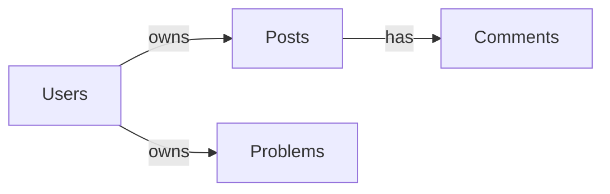

# ProblemSolversHub - Project Report

## 1. Project Overview

### Project name
- `ProblemSolversHub`

### Main purpose and objectives
- A Flutter application for creating, sharing, discovering, and collaborating around programming problem solutions.
- Helps users publish problem explanations, code snippets, and learning notes while connecting through a community-like feed.
- Leverages Firebase backend services to provide authentication, data storage, and analytics.

### Target users
- Competitive programming students and developers.
- Learners who want to document solutions and learn from others.
- Users interested in sharing code walkthroughs, approach reasoning, and problem-solving techniques.

### Core features
- Email/password authentication and Google Sign-In.
- User profile management and settings.
- Create problem solution posts with tags, difficulty, approach, code, and metadata.
- Feed and explore screens for browsing posts.
- Post detail pages with comments, likes, and tabbed discussion.
- Integration with Firebase Auth, Firestore, Storage, and Analytics.

---

## 2. Technology Stack

### Frontend technologies
- Flutter
- Dart

### Backend technologies
- Firebase Auth
- Cloud Firestore
- Firebase Storage
- Firebase Analytics

### Database(s)
- Cloud Firestore
  - `users`
  - `posts`
  - `problems`
  - `posts/{postId}/comments`

### Frameworks, libraries, and tools
- `go_router` for navigation
- `get_it` for DI/service location
- `riverpod` and `flutter_riverpod` for state management
- `flutter_bloc` for BLoC-based state handling
- `google_sign_in` for OAuth login
- `image_picker` for profile picture selection
- `flutter_dotenv` for environment variable loading
- `google_fonts` for typography
- `validators` for form validation
- `intl` for formatting
- `url_launcher` for opening external links

### Build and deployment tools
- Flutter CLI (`flutter pub get`, `flutter run`, `flutter build`)
- Android Gradle wrapper
- Firebase CLI integration implied by `firebase.json`

---

## 3. Project Architecture

### Folder structure
- `lib/main.dart` — app entry point with env loading and Firebase initialization.
- `lib/firebase_options.dart` — generated Firebase config for web, Android, iOS, macOS, Windows.
- `lib/core/` — shared core utilities, theme, router, DI, providers, Firebase init.
- `lib/features/` — feature modules grouped by domain:
  - `auth/` — auth data/repository/domain/presentation.
  - `create/` — create-post flow and widgets.
  - `feed/` — feed screen and widgets.
  - `post/` — post detail view.
  - `posts/` — domain and data logic for post/problem management.
- `lib/shared/` — shared models used across features.
- `lib/ui/` — app shell, global screens, UI widgets.

### Design patterns used
- Clean architecture elements: domain/usecase/repository/data separation.
- Repository pattern for auth and posts.
- Service locator pattern via `GetIt` for DI.
- Riverpod provider graph for reactive state.
- BLoC for create-post and auth flows.
- Shell route and nested routes using `go_router`.

### Application flow

```mermaid
flowchart LR
  A[main.dart] --> B[Load .env]
  A --> C[setupServiceLocator()]
  A --> D[ProviderScope]
  D --> E[FirebaseInitializationSplashScreen]
  E --> F[ProblemSolversHubApp]
  F --> G[goRouterProvider]
  F --> H[authProvider]
  G --> I[AppShell routes]
  I --> J[Feed / Explore / Create / Friends / Profile]
  I --> K[Auth routes]
  J --> L[Repositories / Datasources]
  L --> M[Firestore / FirebaseAuth / FirebaseStorage]
```

### API architecture and routing
- Main route shell wraps primary screens.
- Auth and public routes are separate from the logged-in shell.
- Protected navigation uses auth state listeners to redirect users.
- Router paths include: `/`, `/explore`, `/create`, `/friends`, `/profile`, `/profile/settings`, `/auth`, `/login`, `/signup`, `/forgot-password`, `/activity`.

---

## 4. Feature Analysis

### List of implemented features
- Email/password signup and login.
- Google OAuth sign-in.
- Firebase-authenticated current user state.
- User profile view and stats.
- Profile settings with bio, social links, skills, preferences.
- Create post process with multi-step form.
- Saving posts to Firestore.
- Creating problem records in a separate `problems` collection.
- Explore search and topic filtering.
- Post detail view with comments and likes.
- Real-time post/comment streams in some flows.

### Feature details
#### Authentication
- `FirebaseAuthDatasource` implements login, signup, Google sign-in, logout, current user retrieval, profile update, image upload, account deletion.
- `AuthNotifier` and `AuthBloc` manage auth state.
- Auth UI includes `/login`, `/signup`, `/auth`, `/forgot-password` screens.

#### Create post
- `CreatePostPage` is a three-step flow: problem info, approach, review.
- `CreatePostBloc` submits posts and creates both `posts` and `problems` documents.
- Validation ensures required fields before advancing steps.

#### Feed and explore
- `FeedScreen` currently renders dummy posts and contains TODOs for search and notifications.
- `ExploreScreen` loads posts from Firestore and filters locally.
- Sorting UI is present but not fully implemented.

#### Post detail
- `PostDetailScreen` uses streams for post updates and comments.
- Supports comment submission and like state logic.
- Shows author, timestamp, difficulty badge, and discussion tab.

#### Profile and settings
- `ProfileScreen` renders user profile, stats, achievements, and user posts.
- `ProfileSettingsScreen` allows updating profile fields and account preferences.
- Settings screen handles profile image selection and upload.

### Incomplete / partial features
- `FeedScreen` is still dummy-backed and not connected to Firestore.
- Explore sorting is UI-only and does not reorder actual Firestore queries.
- Feed bottom navigation in `FeedScreen` has placeholder route handling.
- Profile edit button in `ProfileScreen` is not wired to navigation.
- Environment variables are loaded but not used for Firebase config.
- Firestore rules do not match field names used by the app.

---

## 5. Database Analysis

### Collections and relationships
- `users` collection: user profile and preferences.
- `posts` collection: published problem solutions.
- `problems` collection: problem metadata and approach data.
- `posts/{postId}/comments`: comments for each post.

### Relationship diagram



### Data flow between application layers
- UI screens trigger event actions.
- BLoC / providers call usecases.
- Usecases call repositories.
- Repositories delegate to Firebase datasources.
- Datasources read/write Firestore and Storage.

### Auth / authorization mechanisms
- Firebase Auth is used for login and session state.
- `authProvider` maintains current user state.
- App routes redirect based on auth state.
- Firestore security rules require authenticated access for reads/writes.

---

## 6. Code Quality Assessment

### Strengths
- Feature-based project structure.
- Good separation of domain, data, and presentation in auth/posts modules.
- Strong UI with polished screens and consistent theming.
- Good Firebase initialization error handling.
- Use of streams and reactive state for real-time updates.

### Potential bugs or issues
- Duplicate architecture: `GetIt` DI plus Riverpod providers.
- Inconsistent path: some UI writes directly to Firestore while other flows use repositories.
- `FeedScreen` still dummy content.
- `ExploreScreen` sorts with stubbed implementation.
- Mismatch between Firestore rules and actual model fields.
- `flutter_dotenv` is loaded but not used for actual Firebase config.
- `CreatePostScreen` in UI and `CreatePostBloc` both exist, potentially duplicating create logic.

### Security concerns
- Firebase config keys are present in source-controlled files.
- Firestore rules do not reflect the app's actual field names.
- Some Firestore writes occur without repository-level validation.
- User profile access, public listing, and data ownership checks may not be fully aligned with current code.

### Performance concerns
- Explore fetches all posts and filters client-side.
- No pagination on post lists or comments.
- Real-time streams could be expensive without query limits.
- Some features load full collections without constraints.

### Maintainability assessment
- Good modular structure but mixed patterns reduce maintainability.
- Duplicate state management tech increases cognitive load.
- Lack of tests in repository.
- Some duplicated dependencies (`riverpod_generator` in both sections).

---

## 7. Dependencies Report

### Major packages
- `flutter`, `dart`
- `go_router`
- `get_it`
- `riverpod`, `flutter_riverpod`
- `flutter_bloc`
- `firebase_core`, `firebase_auth`, `cloud_firestore`, `firebase_storage`, `firebase_analytics`
- `google_sign_in`
- `image_picker`
- `flutter_dotenv`
- `google_fonts`
- `validators`
- `intl`
- `url_launcher`

### Potentially unnecessary or duplicate packages
- `flutter_bloc` overlaps with Riverpod; choose one primary state management approach.
- `get_it` overlaps with Riverpod DI, creating redundancy.
- `riverpod_generator` appears in both `dependencies` and `dev_dependencies`.
- `flutter_dotenv` is loaded but does not currently configure Firebase.

---

## 8. API Documentation

### Available endpoints
- No custom HTTP API endpoints are present in the repository.
- Backend is Firebase-native, using Firestore and Firebase Auth APIs.

### Firestore request/response structure
- `users/{userId}`: profile document.
- `posts/{postId}`: post document with metadata.
- `posts/{postId}/comments/{commentId}`: comment records.
- `problems/{problemId}`: problem metadata.

#### Example `posts` fields
- `userId`
- `userName`
- `userAvatar`
- `problemTitle`
- `platform`
- `difficulty`
- `tags`
- `approachPreview`
- `approachFull`
- `codeSnippet`
- `likes`
- `comments`
- `views`
- `problemLink`
- `timeComplexity`
- `spaceComplexity`
- `keyLearnings`
- `timestamp`

### Authentication requirements
- Firebase Auth is required for protected app actions.
- UI redirects unauthenticated access to auth routes.
- Firestore rules require `request.auth != null` for most operations.

---

## 9. Deployment Information

### Environment variables required
- `lib/.env` expected by `main.dart`
- Example values are defined in `lib/.env.example`

Required env keys:
- `FIREBASE_API_KEY`
- `FIREBASE_APP_ID`
- `FIREBASE_MESSAGING_SENDER_ID`
- `FIREBASE_PROJECT_ID`
- `FIREBASE_AUTH_DOMAIN`
- `FIREBASE_STORAGE_BUCKET`
- `FIREBASE_MEASUREMENT_ID`
- `ENVIRONMENT`

### Build process
- `flutter pub get`
- `flutter run`
- `flutter build apk --release`
- `flutter build ios --release`
- `flutter build web`

### Deployment workflow
- `firebase.json` configures web hosting output folder: `build/web`.
- Hosting rewrites all routes to `/index.html`.
- Firebase CLI deployment is the likely publish mechanism.

---

## 10. Recommendations

### Suggested improvements
- Standardize state management and DI: choose either Riverpod or BLoC/GetIt.
- Remove duplicate direct Firestore writes from UI screens.
- Wire env variables into Firebase initialization instead of hardcoded generated config.
- Replace dummy feed data with real Firestore stream data.
- Implement Firestore pagination and query-based search.
- Align Firestore security rules with actual app schema.

### Refactoring opportunities
- Consolidate auth flows into one provider or one BLoC system.
- Move `CreatePostScreen` and `CreatePostBloc` into a single consistent create-post pipeline.
- Remove redundant `GetIt` registration if Riverpod is the primary injection system.
- Clean up duplicate dependencies in `pubspec.yaml`.

### Security enhancements
- Avoid storing Firebase config in public repo when possible.
- Harden Firestore rules for user ownership and field validation.
- Add stronger auth checks for profile updates and post operations.

### Performance optimizations
- Add query limits and pagination.
- Use Firestore server-side ordering/filtering rather than in-memory filtering.
- Cache user metadata if reused frequently.

### Scalability considerations
- Use indexed Firestore queries for feed and explore filters.
- Consider Cloud Functions for comment/like aggregation and notification logic.
- Add read/write quotas or rate limiting for high-frequency operations.

---

## 11. Executive Summary

`ProblemSolversHub` is a Flutter/Firebase application designed for a problem-solving community. The codebase is modular with good UI polish and several strong Firebase integrations, but it currently mixes architectural patterns and has partial feature implementations.

The highest-value improvements are:
- standardize architecture,
- complete Firestore-backed feed flows,
- align security rules with actual data models,
- and consolidate auth/data writes into a single service layer.

This project is well positioned for expansion once the architectural duplication is resolved and remaining UI-to-backend integration gaps are closed.
